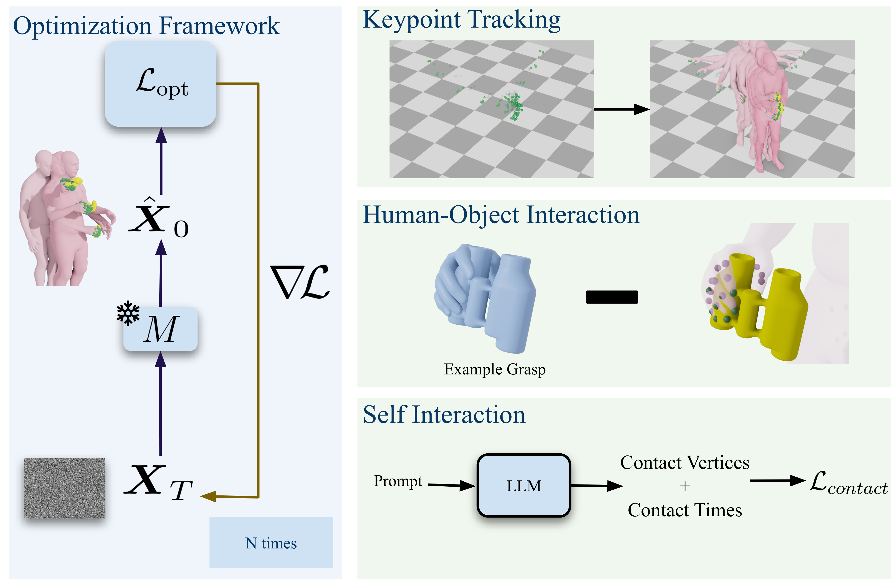

## Welcome to the official implementation of FUSION ! 



## Setup 


### Downloading Files

Please register and download [FUSION](https://fusion.is.tue.mpg.de/) checkpoint.

### Conda Environment 

There is a single conda environment required to run the **FUSION**. Requirements can be found in requirements.txt. To create the environment and install necessary packages:

```
bash sh_scripts/setup_environment.sh
```

This script also unzips the previously downloaded data.zip file. The `data` folder should look like the following (interactive visualization):

<details open>
<summary><strong>📁 data — expected directory layout</strong></summary>

```
data/
├── body_models/
│   ├── mano/
│   │   ├── MANO_LEFT.pkl
│   │   └── MANO_RIGHT.pkl
│   ├── smplx/
│   │   ├── SMPLX_FEMALE.npz
│   │   ├── SMPLX_MALE.npz
│   │   └── SMPLX_NEUTRAL.npz
│   ├── watertight/
│   │   ├── base_mesh.ply
│   │   ├── headless_feetless.ply
│   │   ├── headless_feetless_handless.ply
│   │   ├── conversion_dict.pkl
│   │   ├── lhand_watertight.ply
│   │   └── rhand_watertight.ply
│   ├── MANO_SMPLX_vertex_ids.pkl
│   ├── smplx_parts_segm.pkl
│   └── smplx.faces
├── checkpoints/motionfix/
│   └── <checkpoint files>
├── collision_output/
├── motion/
│   ├── Body_Processed/
│   │   └── <processed body motion files>
│   ├── Body_Raw/
│   │   └── <raw body motion files>
│   ├── Hand_Processed/
│   │   └── <processed hand motion files>
│   ├── Hand_Raw/
│   │   └── <raw hand motion files>
│   ├── precomputed/
│   │   ├── test/
│   │   ├── val/
│   │   └── train/
│   └── statistics.npy
├── sample_data_precomputed/
│   └── xxxxx.p
└── self_interaction/
    ├── self_interaction_dict.p
    ├── self_interaction_dict_valid.p
    ├── sentence_pairs.p
    └── sentence_pairs_bert_table.txt
```

</details>


Here the folder `motion` is only necessary if you want to process data to train the motion prior from scratch. 


### Data Processing(*)

If you want to train your own motion prior then you need to process the data. This means you have to download the raw datasets and run processing scripts. 

```
sh sh_scripts/process_body_datasets.sh
sh sh_scripts/process_hand_datasets.sh
```


## Training (*)

After downloading necessary body models, you can train through:

```
python train.py --trainer-file=configs/trainer.yaml
```

Note: There is already a trained model under the path `fusion_runs/main/0/weights/model-XXXX.pt` (e.g. `model-0001.pt`). No need to train.   

### Motion Generation  

To generate motion from randomly sampled noise, run:

```
python train.py --trainer-file=configs/tester.yaml
``` 

## Optimization 


To run optimization for keypoint tracking on test dataset, run:

```
python src/optim/gen_dno.py --optimizer_file=configs/keypoint_tracking.yaml
```

### Self-Interaction

To run optimization for producing self-interaction motion, run: 

```
python src/optim/gen_dno_app.py --optimizer_file=configs/optimize_self_contact.yaml
```

For converting the BertScore evaluation table to LaTeX, run:

```
python src/eval/eval_llm_output.py
```

By default this only executes `table2latex()`, which reads the precomputed `data/self_interaction/sentence_pairs_bert_table.txt` and writes `sentence_pairs_latex_table.txt`. To (re)compute the BertScores from scratch, uncomment `validate_self_interaction_sequences()`, `get_eval_predictions()` and `compute_bert_similarity()` at the bottom of the script (the first two require an OpenAI API key).

### Human-Object Interaction

You first need to donwload the [GRABNet weights](https://grab.is.tue.mpg.de/download.php). To run the GRABNet-guided optimization on sample sequences:

```
python src/optim/gen_dno_app.py --optimizer_file=configs/optimize_obj_contact_demo.yaml
```

## Acknowledgements

Our codebase builds on couple of wonderful open-sourced projects. 

- Data processing and model architecture are adapted from [MotionFix](https://github.com/atnikos/motionfix) 
- Diffusion noise optimization part is adapted from [DNO](https://github.com/korrawe/Diffusion-Noise-Optimization).
- Our method uses [GRABNet](https://github.com/otaheri/GRAB) for object grasping.  
- We use [OmniControl](https://github.com/neu-vi/OmniControl) codebase to report quantitative results on HumanML3D and KIT-ML datasets. 
- We use [MANO](https://mano.is.tue.mpg.de/) hand model and [SMPLX](https://smpl-x.is.tue.mpg.de/) body model. 
- We use [Torch-Mesh-Isect](https://github.com/vchoutas/torch-mesh-isect) for self-intersection loss. 

**Huge thanks to these great open-source projects! This project would be impossible without them.**

## Citation

If you found this code or paper useful, please consider citing:
```
@InProceedings{Duran_2026_CVPR,
    author    = {Duran, Enes and Athanasiou, Nikos and Kocabas, Muhammed and Black, Michael J. and Taheri, Omid},
    title     = {FUSION: Full-body Unified Motion Prior for Body and Hands Via Diffusion},
    booktitle = {Proceedings of the IEEE/CVF Conference on Computer Vision and Pattern Recognition (CVPR) Findings},
    month     = {June},
    year      = {2026},
    pages     = {3438-3448}
}
```

## Contact
Should you run into any problems or have questions, please create an issue or contact `enes.duran@uni-tuebingen.de`.
